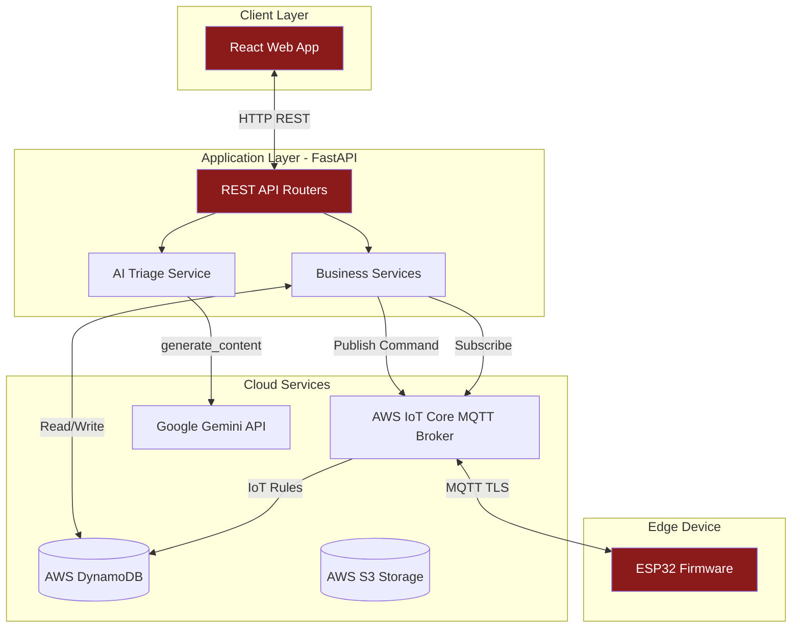
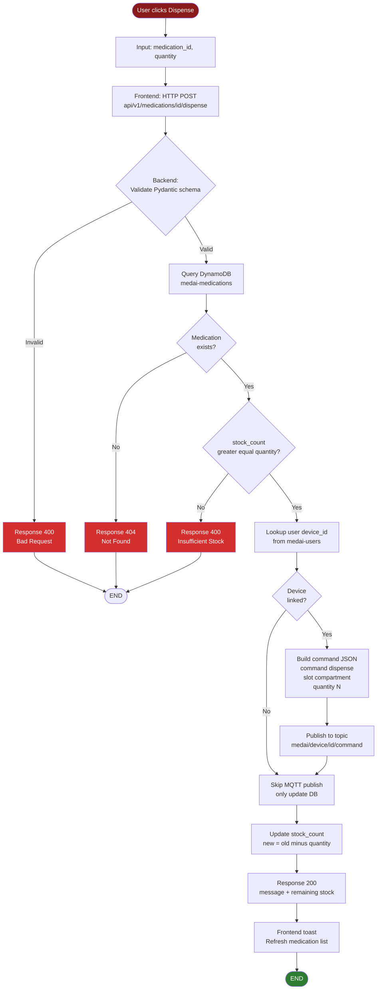
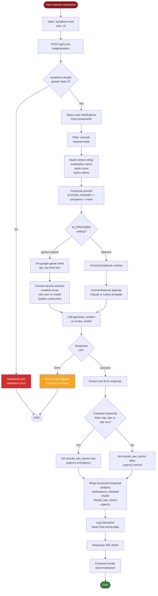
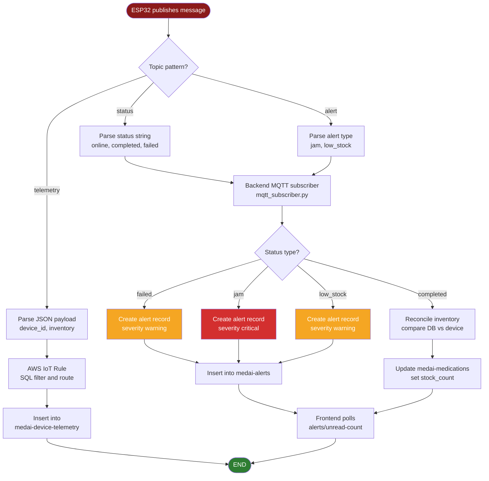

# MedAI Cabinet — Software Design

## Hardware Components (tham chiếu)

| Loại | Model | Vai trò |
|------|-------|---------|
| Microcontroller | ESP32-WROOM-32 | Bộ điều khiển trung tâm, WiFi/MQTT |
| Stepper Motor | 28BYJ-48 (5V, 2048 steps/rev) × 3 | Xoay đĩa thuốc trong từng ngăn |
| Motor Driver | ULN2003 × 3 | Điều khiển stepper motor |
| Sensor | IR Obstacle Sensor (FC-51) | Phát hiện thuốc rơi và việc lấy thuốc |
| Cloud | AWS IoT Core, DynamoDB, Bedrock | Backend hạ tầng |

---

## 1. System Architecture — Kiến trúc phần mềm

---

## 2. Dispense Request Flow — Luồng xử lý lệnh phát thuốc

Mô tả cách phần mềm xử lý khi user bấm nút "Lấy thuốc". Đây là flowchart chính thể hiện input → decision → output.

---

## 3. AI Triage Pipeline — Luồng xử lý tư vấn AI

Mô tả cách phần mềm xử lý input triệu chứng từ user, làm giàu context, gọi Gemini API, và parse output.

---

## 4. Telemetry Ingestion — Xử lý dữ liệu từ thiết bị

Khi ESP32 publish telemetry (inventory update, status), phần mềm backend xử lý và đồng bộ.

---

## Notes

- Mỗi flowchart là 1 sơ đồ độc lập — có thể paste từng cái vào https://mermaid.live/ để export PNG/SVG.
- Diamond (`{...}`) là decision point.
- Rectangle (`[...]`) là process step.
- Stadium (`([...])`) là start/end terminator.
- Kiểu trình bày này là **standard flowchart symbols** theo ISO 5807.
