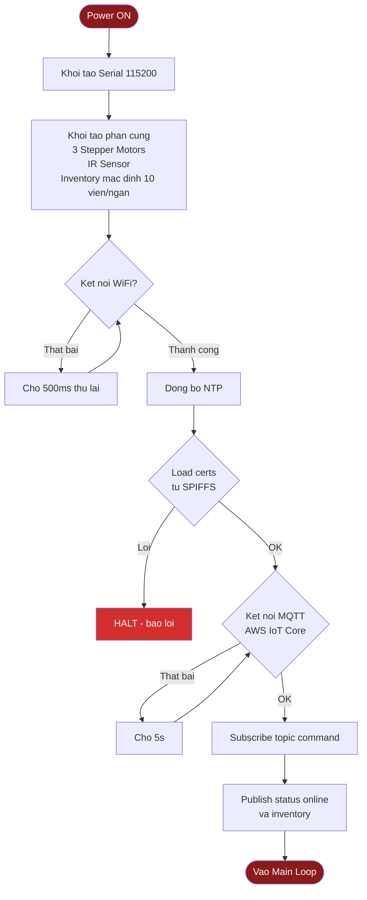
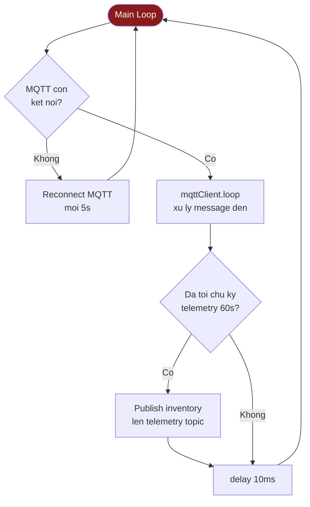
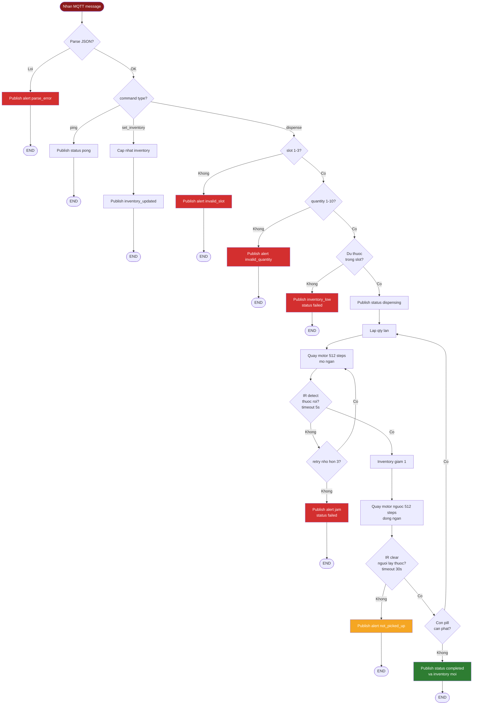
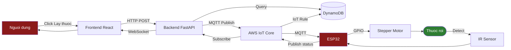

# Lưu đồ thuật toán — MedAI Cabinet ESP32 Firmware

> **Cách dùng**: Vào https://mermaid.live/ và paste **TỪNG SƠ ĐỒ MỘT** (không paste cả file).
> Hoặc mở file này trong VS Code với extension "Markdown Preview Mermaid Support".

---

## 1. Setup — Khởi động thiết bị

---

## 2. Main Loop — Vòng lặp chính

---

## 3. Xử lý lệnh dispense — Khi nhận command từ backend

---

## 4. Tổng quan toàn hệ thống

